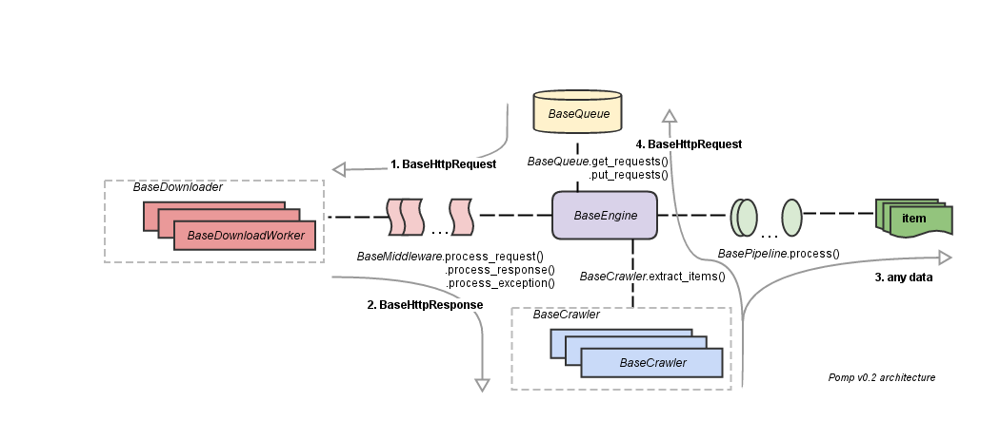

.. _architecture:

.. currentmodule:: pomp.core

Architecture
============

Similarly to `Scrapy architecture`_

1. Request (:class:`base.BaseHttpRequest`) from queue
   (:class:`base.BaseQueue`) by engine (:class:`base.BaseEngine`)
   passed to middlewares (:class:`base.BaseMiddleware`) and then executed
   by downloader (:class:`base.BaseDownloader`). Downloader can process
   request in concurrent way and return deferred result
   (:class:`utils.Planned`).

2. Response (:class:`base.BaseHttpResponse`) passed back to middlewares in
   reverse order and then to the crawler (:class:`base.BaseCrawler`).
   Crawler can process response in concurrent way and return deferred
   result like downloader.

3. Extracted data passed to item pipeline.

4. Next requests if they exists will be putted to the queue.

.. _Scrapy architecture: http://doc.scrapy.org/en/latest/topics/architecture.html
